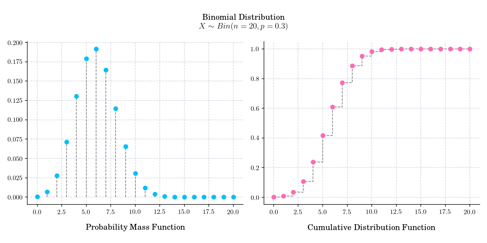

# Day 1 : Binomial Distribution

In probability theory and [statistics](https://en.wikipedia.org/wiki/Statistics), the **Binomial distribution** with parameters _n_ and _p_ is the 
[discrete probability distribution](https://en.wikipedia.org/wiki/Discrete_probability_distribution) of the number of successes in a sequence of _n_ [independent](https://en.wikipedia.org/wiki/Statistical_independence) experiments, each asking a [yes–no question](https://en.wikipedia.org/wiki/Yes%E2%80%93no_question), and each with its own
 Boolean-valued outcome: _success_ (with probability _p_) or_failure_ (with probability q=1-p.

## 🔔 Random Facts 🔔

Let X ~ Bin(n, p1) and Y ~ Bin(m, p2) be independent. Let T = (X/n) / (Y/m). Then log(T) is approximately normally distributed with mean log(p1/p2) and variance ((1/p1) − 1)/n + ((1/p2) − 1)/m. This result was proved by Katz et. al. in 1978 in their paper ["Obtaining Confidence Intervals for the Risk Ratio in Cohort Studies"](https://www.jstor.org/stable/2530610).
