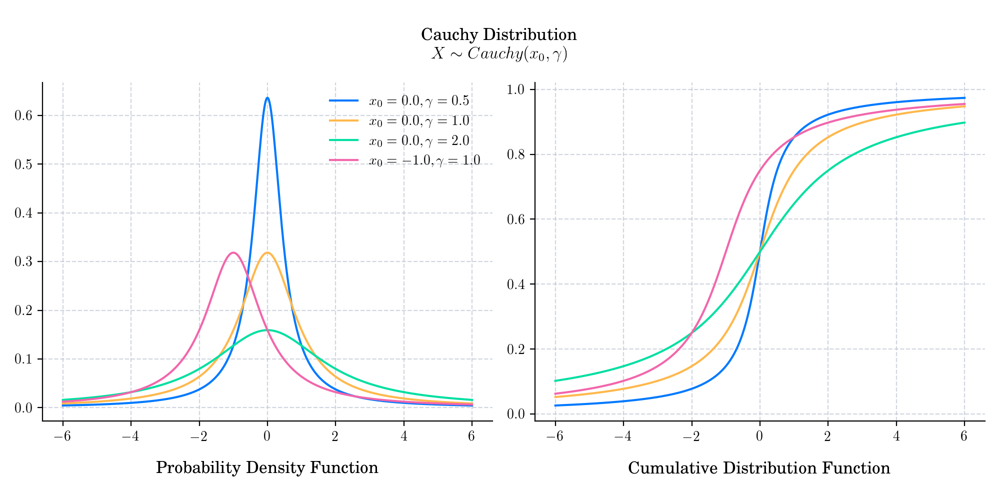

## Day 3 : Cauchy Distribution

The [Cauchy distribution](https://en.wikipedia.org/wiki/Cauchy_distribution), named after French mathematician [Augustin Cauchy](https://en.wikipedia.org/wiki/Augustin_Cauchy), and also called the Lorentzian distribution or Lorentz distribution, is a continuous distribution describing resonance behaviour. 

The Cauchy distribution with location and scale parameters $x_0$ and $\gamma$, respectively, describes the distribution of the _x_\-intercept of a ray issuing from $(x_{0},\gamma)$ with a uniformly distributed angle. The Cauchy distribution is often used in statistics as the canonical example of a "[pathological](https://en.wikipedia.org/wiki/Pathological_\(mathematics\))" distribution since both its
[expected value](https://en.wikipedia.org/wiki/Expected_value) and its [variance](https://en.wikipedia.org/wiki/Variance) are undefined.

The probability density function is given by

$$f(x) = \frac{1}{\pi \gamma \left[ 1 + \left(\frac{x-x\_0}{\gamma} \right)^2 \right]}, \qquad x\in(-\infty, \infty).$$

The cumulative distribution function is given by

$$F(x) = \frac{1}{\pi} \arctan \left(\frac{x-x\_0}{\gamma}\right) +\frac{1}{2}, \qquad x\in(-\infty, \infty).$$

### 🔔 Random Facts 🔔

- Let $X$ and $Y$ be independent standard normal distributions $X, Y \sim N(0, 1)$. Their ratio follows a standard (location and scale parameters equal to 0 and 1, respectively) Cauchy distributions _X/Y_ ~ Cauchy(_0_,_1_)

- The Cauchy distribution is [stable](https://en.wikipedia.org/wiki/Stable_distribution) 🪄. Moreover, it is one of the few stable distributions with a probability density function that can be expressed analytically, the others being the [normal distribution](https://en.wikipedia.org/wiki/Normal_distribution) and the [Lévy distribution](https://en.wikipedia.org/wiki/L%C3%A9vy_distribution)
