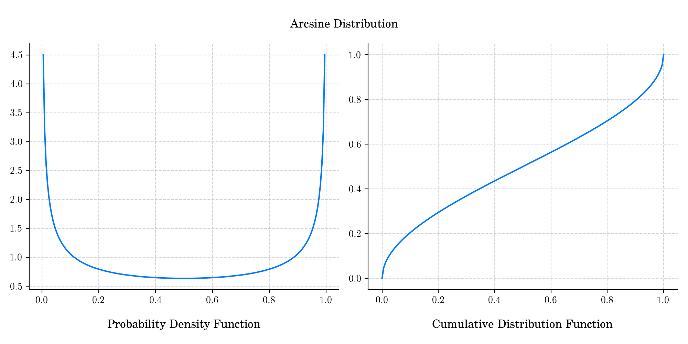

# Day 6 : Arcsin

The standard arcsine (or simply arcsine) distribution is a special case of the beta distribution (see Day 2 of the Calendar) with _α_ = _β_ = 1/2.

The probability density function is given by

$$f(x) = \frac{1}{\pi \sqrt{x(1-x)}}, \qquad x\in [0,1].$$

The cumulative distribution function is given by

$$F(x) = \frac{2}{\pi} \arcsin (\sqrt{x}), \qquad x\in [0,1].$$

## 🔔 Random Facts 🔔

- Let $\{W(t) : t\in[0,1] \}$ be a standard Brownian motion on $[0,1]$, and consider the following random variables:

- The proportion of the time that $W$ remains positive: 

$$T^{+} = \lambda(\{ t\in[0,1] : W(t) >0\}),$$ 

where $\lambda$ denotes the Lebesgue measure.

- The last time that $W$ crosses the origin: 

$$L = \sup \{ t \in [0,1] : W(t) = 0\}.$$

- The time at which $W$ reaches its maximum: 

$$M^{\ast} = \arg \max_{0\leq t\leq 1} W(t).$$

- These three random variables follow the arcsin distribution. These properties are known as arcsin laws (or Levy arcsine laws). In particular, the fact that $L\sim Arcsin$, was noted by French mathematician [Paul Lévy](https://en.wikipedia.org/wiki/Paul_L%C3%A9vy_\(mathematician\)) in 1939, in his paper ["On certain homogeneous stochastic processes"](http://www.numdam.org/item/?id=CM_1940__7__283_0).

- The prime divisors of natural numbers follow a distribution which is closely related to the Arcsine distribution. This was stated without proof in 1969 by Hungarian mathematician [Paul Erdős](https://en.wikipedia.org/wiki/Paul_Erd%C5%91s), and subsequently proved (see e.g. Manstavičius, E. (1994), "A proof of the Erdős arcsine law") and is now known as the [Erdős arcsine law](https://en.wikipedia.org/wiki/Erdős_arcsine_law).
