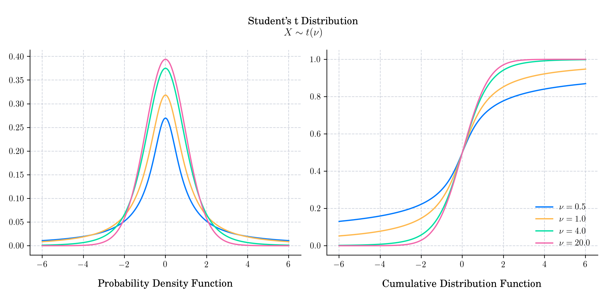

# Day 7 : Student's T

The Student's _t_-distribution (or simply the _t_-distribution) is a continuous [probability distribution](https://en.wikipedia.org/wiki/Probability_distribution) that generalises the [standard normal distribution](https://en.wikipedia.org/wiki/Normal_distribution#Standard_normal_distribution). Like the latter, it has support $(-\infty, \infty)$, is symmetric around zero, and bell-shaped. However, it has [heavier tails](https://en.wikipedia.org/wiki/Heavy-tailed_distribution) and the amount of probability mass in the tails is controlled by its parameter $\nu>0$, which is known as degrees of freedom.

The probability density function is given by

$$f(x) = \frac{\Gamma\left( \frac{\nu + 1}{2} \right) }{\sqrt{\nu \pi} \Gamma \left(\frac{\nu}{2}\right)} \left(1 + \frac{x^2}{\nu}\right)^{-\frac{\nu + 1}{2}} .$$

The cumulative distribution function is given by

$$F(x) = \frac{1}{2} + x \Gamma \left(\frac{\nu + 1}{2} \right) 2F_1\left( \frac{1}{2}, \frac{\nu + 1}{2}; \frac{3}{2}; -\frac{x^2}{\nu} \right) \frac{1}{\sqrt{\pi\nu} \Gamma\left(\frac{\nu}{2}\right) } ,$$

where $2F_1$ is the hypergeometric function.

## 🔔 Random Facts 🔔

- If $\nu = 1$, then it coincides with the Cauchy distribution.

- It approaches the standard normal distribution as its parameter $\nu\rightarrow \infty$.

- It takes its name from English statistician, chemist, and brewer [William Sealy Gosset](https://en.wikipedia.org/wiki/William_Sealy_Gosset) who proposed it in a paper published in the journal _[Biometrika](https://en.wikipedia.org/wiki/Biometrika)_ in 1908, under the pseudonym _"Student"_. One version of the origin of the pseudonym is that Gosset's employer preferred staff to use pen names when publishing scientific papers instead of their real name, so he used the name "Student" to hide his identity. Another version is that Guinness did not want their competitors to know that they were using the _t_-test to determine the quality of raw material.
