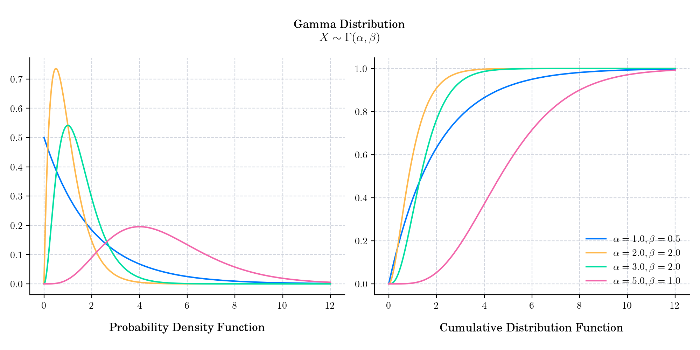

# Day 9 : Gamma

The Gamma distribution is a two-[parameter](https://en.wikipedia.org/wiki/Statistical_parameter) family of continuous [probability distributions](https://en.wikipedia.org/wiki/Probability_distribution).

The probability density function is given by

$$f(x) =\frac{\beta^{\alpha}}{\Gamma(\alpha)} x^{\alpha-1} e^{-\beta x}, \qquad x\geq 0.$$

The cumulative distribution function is given by

$$F(x) =\frac{1}{\Gamma(\alpha)} \gamma(\alpha, \beta x), , \qquad x\geq 0,$$

where $\gamma(\alpha, \beta x)$ is the lower [incomplete gamma function](https://en.wikipedia.org/wiki/Incomplete_gamma_function).

## 🔔 Random Facts 🔔

- The gamma distribution is widely used in Bayesian statistics as a [conjugate prior](https://en.wikipedia.org/wiki/Conjugate_prior). It is the conjugate prior for the [precision](https://en.wikipedia.org/wiki/Precision_\(statistics\)) (i.e. inverse of the variance) of a [normal distribution](https://en.wikipedia.org/wiki/Normal_distribution). It is also the conjugate prior for the [exponential distribution](https://en.wikipedia.org/wiki/Exponential_distribution).

- The [exponential distribution](https://en.wikipedia.org/wiki/Exponential_distribution), [Erlang distribution](https://en.wikipedia.org/wiki/Erlang_distribution), and the [chi-squared distribution](https://en.wikipedia.org/wiki/Chi-squared_distribution) are all special cases of the gamma distribution.
