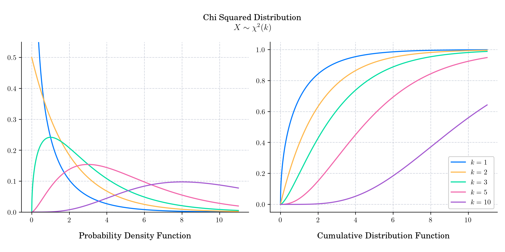

# Day 12 : Chi Squared

The chi-squared distribution (also called chi-square) with $k>0,$ [degrees of freedom](https://en.wikipedia.org/wiki/Degrees_of_freedom_\(statistics\)) is the distribution of the sum of the squares of $k$ [independent](https://en.wikipedia.org/wiki/Independence_\(probability_theory\)) [standard normal](https://en.wikipedia.org/wiki/Standard_normal) random variables. 

The probability density function is given by

$$f(x) = \frac{1}{2^{k/2} \Gamma(k/2)} x^{k/2 - 1} e^{-x/2}, \qquad x\geq 0,$$

where $\Gamma$ is the [Gamma function](https://en.wikipedia.org/wiki/Gamma_function).

The cumulative distribution function is given by

$$F(x) = \frac{1}{\Gamma(k/2)} \gamma\left(\frac{k}{2}, \frac{x}{2} \right), \qquad x\geq 0,$$

where $\gamma$ is the [lower incomplete gamma function](https://en.wikipedia.org/wiki/Lower_incomplete_gamma_function).

## 🔔 Random Facts 🔔

- It converges to a normal distribution for large $k$ (by the [central limit theorem](https://en.wikipedia.org/wiki/Central_limit_theorem)). For many practical purposes, for $k>50$ the distribution is sufficiently close to a [normal distribution](https://en.wikipedia.org/wiki/Normal_distribution).

- It is a special case of the Gamma distribution (Day 9) and is one of the most widely used probability distributions in inferential statistics, notably in hypothesis testing, and confidence intervals for population variance when the underlying distribution is normal. 

- The sum of independent chi-squared variables is also chi-squared distributed. Specifically, if $X_i, i= 1,\cdots n$, are independent chi-squared random variables with $k_i, i=1,\cdots,n$ degrees of freedom, respectively, then $Y= X_1 + \cdots + X_n$ is chi-squared distributed with $k=k_1+\cdots+k_n$ degrees of freedom.
