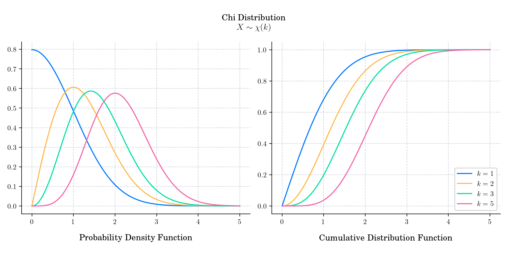
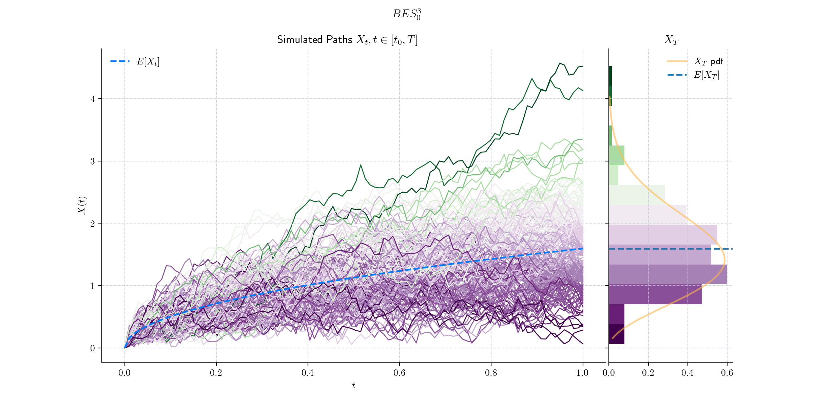

# Day 15 : Chi

The chi distribution is a continuous probability distribution with support in $[0, \infty)$. It is the distribution of the positive square root of a sum of squared independent standard [normal random variables](https://en.wikipedia.org/wiki/Normal_distribution). Equivalently, it is the distribution of the [Euclidean distance](https://en.wikipedia.org/wiki/Euclidean_distance) between a multivariate Gaussian random variable and the origin. It is thus related to the Chi squared (Day 12) distribution by describing the distribution of the positive square roots of a random variable following a Chi squared distribution.

The probability density function is given by

$$f(x) = \frac{1}{2^{(k/2) - 1} \Gamma(k/2) } x^{k-1} e^{-x^2/2}, \qquad x\geq 0.$$

The cumulative distribution function is given by

$$F(x) = P(k/2, x^2/2) , \qquad x\geq 0,$$

where $P$ is the [regularized gamma function](https://en.wikipedia.org/wiki/Incomplete_gamma_function#Regularized_gamma_functions_and_Poisson_random_variables).

## 🔔 Random Facts 🔔

- The Chi distribution with $k=2$ degrees of freedom is known as the [Rayleigh distribution](https://en.wikipedia.org/wiki/Rayleigh_distribution), named after British mathematician and physicist [Lord Rayleigh](https://en.wikipedia.org/wiki/John_Strutt,_3rd_Baron_Rayleigh) --- who won the [Nobel Prize in Physics](https://en.wikipedia.org/wiki/Nobel_Prize_in_Physics) in 1904 "for his investigations of the densities of the most important gases and for his discovery of [argon](https://en.wikipedia.org/wiki/Argon) in connection with these studies.

- The Chi distribution with $k=3$ degrees of freedom is known as the [Maxwell–Boltzmann distribution](https://en.wikipedia.org/wiki/Maxwell%E2%80%93Boltzmann_distribution). This distribution originated to describe particle [speeds](https://en.wikipedia.org/wiki/Speed) in [idealized gases](https://en.wikipedia.org/wiki/Ideal_gas), where the particles move freely inside a stationary container without interacting with one another, except for very brief [collisions](https://en.wikipedia.org/wiki/Collision) in which they exchange energy and momentum with each other or with their thermal environment.

- If $X$ follows a Chi distribution with $k$ degrees of freedom, then $X^2$ follows a  Chi Squared distribution with the same degrees of freedom.

- The Chi distribution also arises in the context of Bessel processes. 

Today's **bonus plot** shows a simulation from a Bessel process of dimension 3. The marginal distribution on the right side follows a Chi distribution!

