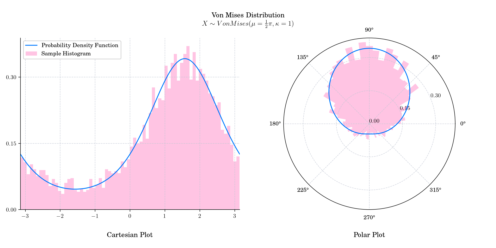

# Day 16 : Von Mises

The [von](https://en.wikipedia.org/wiki/Richard_von_Mises) ****[Mises](https://en.wikipedia.org/wiki/Richard_von_Mises) distribution, named after Austrian scientist Richard von Moses, is a unimodal probability distribution on the circle. It is also known as the circular normal distribution or [Tikhonov](https://en.wikipedia.org/wiki/Andrey_Nikolayevich_Tikhonov) distribution. It is a close approximation to the [wrapped normal distribution](https://en.wikipedia.org/wiki/Wrapped_normal_distribution), which is the circular analogue of the [normal distribution](https://en.wikipedia.org/wiki/Normal_distribution). It is defined by a location parameter $\mu \in \mathbb{R}$, and a concentration measure $\kappa >0$. The concentration parameter is the reciprocal of dispersion.

The probability density function is given by

$$f(x) = \frac{e^{\kappa \cos (x-\mu)}}{ 2 \pi I_0(\kappa)},$$

where $I_0(\kappa)$ is the modified [Bessel function](https://en.wikipedia.org/wiki/Bessel_function#Bessel_functions_of_the_first_kind:_J%CE%B1) of the first kind of order 0, with this scaling constant chosen so that the distribution sums to unity:  $\int _{-\pi }^{\pi }\exp(\kappa \cos x)dx={2\pi I_{0}(\kappa )}$.

The cumulative distribution function is not analytical.

## 🔔 Random Facts 🔔

- When $\kappa$ is large, the distribution resembles a [normal distribution](https://en.wikipedia.org/wiki/Normal_distribution). More precisely, as $\kappa$ goes to infinity, the it converges to a normal distribution $N(\mu, \sigma^2)$ where $\sigma^2 = 1/\kappa$.

- When $\kappa$ tends to zero, the probability density function resembles the density of a [uniform distribution](https://en.wikipedia.org/wiki/Uniform_distribution_\(continuous\)) defined on the chosen interval of length $2\pi$.

- The von Mises distribution is a special case of the [von Mises–Fisher distribution](https://en.wikipedia.org/wiki/Von_Mises%E2%80%93Fisher_distribution) on the _N_-dimensional sphere.

- It can be obtained as the hitting density of a two-dimensional Brownian motion starting at the origin, with constant drift velocity and direction. This was shown in ["A Characterization of the Von Mises Distribution."](https://projecteuclid.org/journals/annals-of-statistics/volume-5/issue-4/A-Characterization-of-the-Von-Mises-Distribution/10.1214/aos/1176343906.full) (Ann. Statist. 5 (4) 813 - 814, July, 1977)

- The von Mises distribution is commonly used in the statistical analysis of directions which in turn has many uses in areas such as meteorology, earth sciences, physics, and biology.

Today's bonus plot shows the probability density function in both Cartesian and Polar coordinates!

