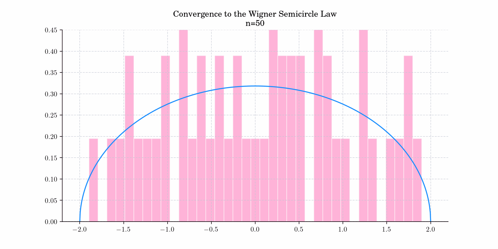

# Day 18 : Wigner Semicircle

The Wigner semicircle distribution, named after the Hungarian-American [theoretical physicist](https://en.wikipedia.org/wiki/Theoretical_physicist) [Eugene Wigner](https://en.wikipedia.org/wiki/Eugene_Wigner), is the probability distribution on [−_R_, _R_] whose probability [density function](https://en.wikipedia.org/wiki/Probability_density_function) is a scaled semicircle centered at (0, 0). The parameter R is commonly referred to as the "radius" parameter of the distribution.

The probability density function is given by

$$f(x) = \frac{2}{\pi R^2} \sqrt{R^2 - x^2},$$

The cumulative distribution function is given by

$$F(x) =\frac{1}{2} + \frac{x\sqrt{R^2 - x^2}}{\pi R^2} + \frac{\arcsin\left(\frac{x}{R}\right) }{\pi}.$$

## 🔔 Random Facts 🔔

- The Wigner distribution coincides with a scaled beta distribution. That is, if _Y_ is a beta-distributed random variable with parameters α = β = 3/2, then the random variable _X_ = 2_RY_ – _R_ follows a Wigner semicircle distribution with radius R.

- In [free probability](https://en.wikipedia.org/wiki/Free_probability) theory, the role of Wigner's semicircle distribution is analogous to that of the normal distribution in classical probability theory. Namely, in free probability theory, the role of [cumulants](https://en.wikipedia.org/wiki/Cumulant) is occupied by "free cumulants", whose relation to ordinary cumulants is simply that the role of the set of all [partitions of a finite set](https://en.wikipedia.org/wiki/Partition_of_a_set) in the theory of ordinary cumulants is replaced by the set of all [noncrossing partitions](https://en.wikipedia.org/wiki/Noncrossing_partition) of a finite set. Just as the cumulants of degree more than 2 of a [probability distribution](https://en.wikipedia.org/wiki/Probability_distribution) are all zero [if and only if](https://en.wikipedia.org/wiki/If_and_only_if) the distribution is normal, so also, the _free_ cumulants of degree more than 2 of a probability distribution are all zero if and only if the distribution is Wigner's semicircle distribution.

- The distribution arises as the limiting distribution of the [eigenvalues](https://en.wikipedia.org/wiki/Eigenvalues) of many [random symmetric matrices](https://en.wikipedia.org/wiki/Random_matrices), that is, as the dimensions of the random matrix approach infinity. This is known as the Semicircle Law and was first observed by Wigner (1955) for certain special classes of [random matrices](https://mathworld.wolfram.com/RandomMatrix.html) arising in quantum mechanical investigations. Today's bonus shows a simulation demonstrating this convergence.

