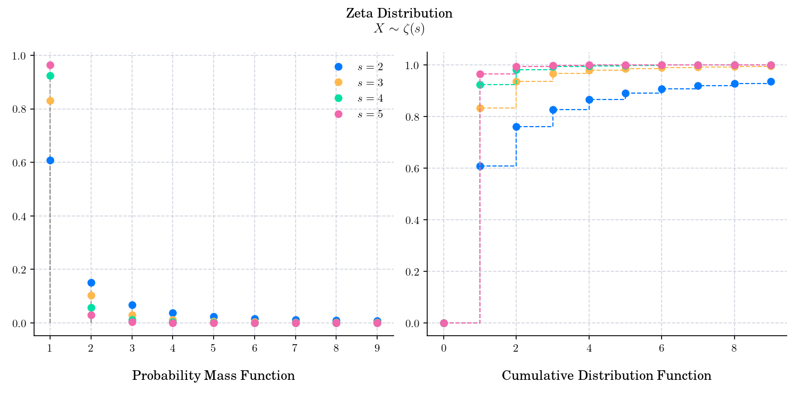
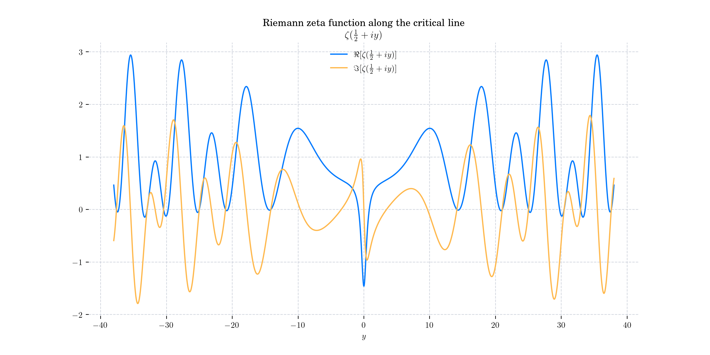
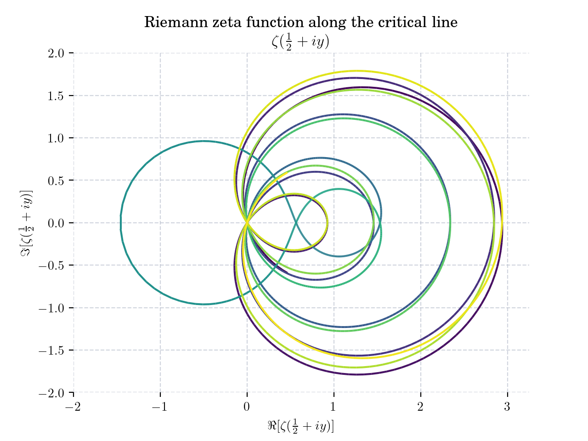

# Day 19 : Zeta

The zeta distribution is a discrete probability distribution with support on $\mathbb{N^+}$ and is defined by a shape parameter $s>1$. As its name indicates, it is closely related to the famous Riemann zeta function 𝜁, named after German mathematician Bernhard Riemann.

The probability mass function is given by

$$f(k) = \frac{1}{\zeta(s) k^s}, \qquad k = 1, 2, 3, \cdots.$$

The cumulative distribution function is given by

$$F(k) =\frac{H_{k, s}}{\zeta(s)},$$

where $H_{k, s}$ is the generalized [harmonic number](https://en.wikipedia.org/wiki/Harmonic_number):

$$H_{k,s} = \sum_{i=1}^k \frac{1}{i^s}.$$

## 🔔 Random Facts 🔔

- It is used to model the size or ranks of certain types of objects randomly chosen from certain types of populations. Typical examples include the frequency of occurrence of a word randomly chosen from a text, or the population rank of a city randomly chosen from a country.

- It is also known as the Zipf distribution, in honor of American [linguist](https://en.wikipedia.org/wiki/Linguistics) and [philologist](https://en.wikipedia.org/wiki/Philologist) George Zipf, who studied [statistical](https://en.wikipedia.org/wiki/Statistics) occurrences in different [languages](https://en.wikipedia.org/wiki/Language).

- The n-th raw [moment](https://en.wikipedia.org/wiki/Moment_\(mathematics\)) of the zeta distribution with parameter $s$, is defined as:

$$m_{n}=E(X^{n})={\frac  {1}{\zeta (s)}}\sum _{{k=1}}^{\infty }{\frac  {1}{k^{{s-n}}}}$$

The series on the right is just a series representation of the Riemann zeta function, but it only converges for values of $s-n$ that are greater than unity. Thus, 

[//]: # ($$m_{n}=\left\{{\begin{matrix}\zeta &#40;s-n&#41;/\zeta &#40;s&#41;&{\textrm  {for}}~n<s-1\\\infty &{\textrm  {for}}~n\geq s-1\end{matrix}}\right.$$)

The ratio of the zeta functions is well-defined, even for _n_ > _s_ − 1 because the series representation of the zeta function can be [analytically continued](https://en.wikipedia.org/wiki/Analytic_continuation). This does not change the fact that the moments are specified by the series itself, and are therefore undefined for large _n_. Therefore, the moment generating function of the zeta distribution does not exist.

Today's **bonus** is two plots of the Riemann Zeta function evaluated in the critical line!

