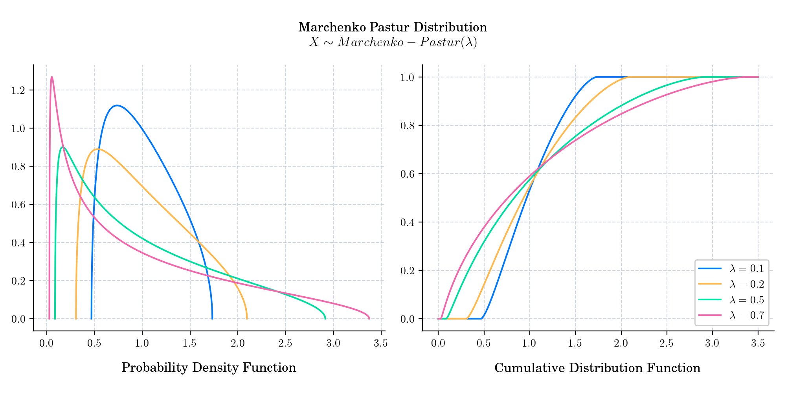

# Day 22 : Marchenko-Pastur Distribution

The Marchenko–Pastur distribution, or Marchenko–Pastur law, describes the asymptotic behavior of [singular values](https://en.wikipedia.org/wiki/Singular_value) of large rectangular [random matrices](https://en.wikipedia.org/wiki/Random_matrix). It is named after soviet mathematicians [Volodymyr Marchenko](https://en.wikipedia.org/wiki/Volodymyr_Marchenko) and [Leonid Pastur](https://en.wikipedia.org/wiki/Leonid_Pastur) who published it in 1967 (Distribution of Eigenvalues for Some Sets of Random Matrices).

## 🔔 Random Facts 🔔

- The Marchenko-Pastur law was proved a little over a decade after the Wigner's semicircle law but comes from a similar motivation. Instead of looking at the distribution of eigenvalues of a symmetric matrix, it looks at the distribution of eigenvalues of the covariance matrix of a given rectangular matrix. 

- If $X$ denotes a $m\times n$ random matrix whose entries are independent identically distributed random variables with zero mean and variance $\sigma^2<\infty$, let $$S_n = \frac{1}{n}XX^{t},$$ and let $\lambda_1, \cdots, \lambda_m$ be the eigenvalues of $S_n$. Assume that both $m$, and $n$ tend to infinity so that  the ratio $m/n \rightarrow \lambda \in (0,1)$. Then, the empirical spectral distribution $F_n$ converges weakly to the Marchenko-Pastur distribution with density

$$f(x) = \frac{\sqrt{(b-x)(x-a)}}{2\pi x \lambda}, \quad x\in[a,b] ,$$

where $a = \sigma^2 (1- \sqrt{\lambda})^2$ and $b = \sigma^2 (1+\sqrt{\lambda})^2$.

- The Marchenko–Pastur law also arises as the [free Poisson law](https://en.wikipedia.org/wiki/Poisson_distribution#Free_Poisson_distribution) in free probability theory, having rate $1/\lambda$ and jump size $\sigma^2$.

- The moments of the Marchenko-Pastur distribution are related to [Narayana numbers](https://en.wikipedia.org/wiki/Narayana_number) which are famous numbers in combinatorics.

Today's bonus is an animation showing the convergence to the Marchenko-Pastur law.

