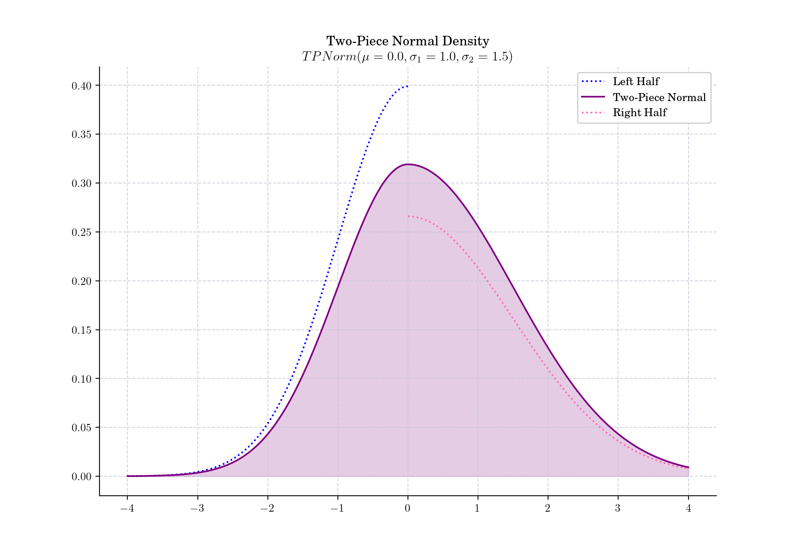

# Day 23 : Two-Piece Normal Distribution

The two-piece normal, also known as [split normal](https://en.wikipedia.org/wiki/Split_normal_distribution), binormal, or double-Gaussian,  results from joining at the mode the corresponding halves of two normal distributions with the same mode $\mu$ but different standard deviations $\sigma_1$ and $\sigma_2$. This idea can be seen in the following plot where we can see the two half densities (in blue and pink) and the resulting two-piece normal density (in purple).

The probability density function is given by

$$  
f(x) =  
\begin{cases}  
\dfrac{2}{\sigma_1+\sigma_2}\phi\left(\dfrac{x-\mu}{\sigma_1}\right), \qquad \mbox{if } x < \mu, \\  
\dfrac{2}{\sigma_1+\sigma_2}\phi\left(\dfrac{x-\mu}{\sigma_2}\right), \qquad \mbox{if } x \geq \mu. \\  
\end{cases}  
$$

where $\phi$ denotes the density function of a standard normal distribution.

## 🔔 Random Facts 🔔

- The two-piece normal was proposed by German physicist and phycologist [Gustav Fechner](https://en.wikipedia.org/wiki/Gustav_Fechner) -who is also consider the founder of [psychophysics](https://en.wikipedia.org/wiki/Psychophysics)\- around 1887 but published posthumously ten years later. Unfortunately, Fechner work did not become popular and this lead to a series of re discoveries (as recent as 2016!).

- If $\sigma_1=\sigma_2$, then the two-piece normal becomes a normal distribution.

- The Two-Piece normal, and more generally the family of two-piece distributions, have been extensively used in applications such as:
    - Bank of England Fan Charts for Inflation Report
    
    - Measurement Errors Models
    
    - Forecasting and Estimation of Risk

Today's bonus plot is a fan chart showing the historical CPI inflation as well as its projection as of 2023-Q3. The Bank of England uses a two-piece normal distribution to model the quarterly inflation forecasts.

